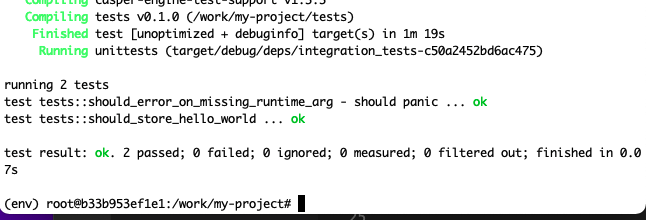
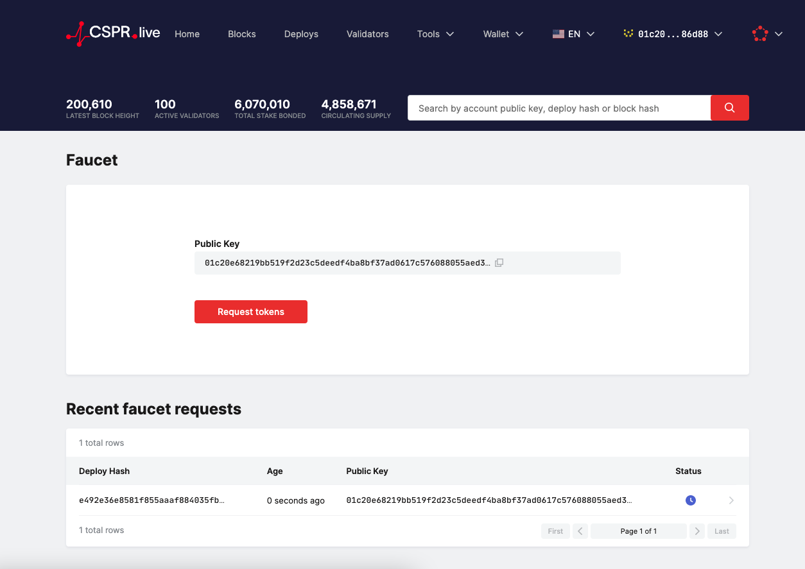

# Get Started With Casper

## Setup local node:
References: https://docs.casperlabs.io/en/latest/dapp-dev-guide/setup-nctl.html


## Install casper-client:


## 1. Create and deploy a simple, smart contract with cargo casper and cargo test.

### Create and build contract:


### Test contract:



### Deploy contract:

```
casper-client put-deploy \
    --node-address http://localhost:11101 \
    --chain-name casper-net-1 \
    --secret-key /work/casper-node/utils/nctl/assets/net-1/faucet/secret_key.pem \
    --payment-amount 5000000000000 \
    --session-path /work/my-project/contract/target/wasm32-unknown-unknown/release/contract.wasm
```


### Check status
```
casper-client get-deploy --node-address http://localhost:11101 3e5a599faaef44ab19dfc83926ae1bc6becac3a48063cc15354d415dd3d69789
```


## 2. Complete one of the existing tutorials for writing smart contracts

<b>Multi-Signature Tutorial</b>


```
npm i
npm run start:atomic
```


The results is following:
```
0.1 Fund main account.

Signed by: account-hash-df2b14076145f3a0101636b1c3b6d8f96f900bb501832bd04a5ca845a86a9226
Deploy hash: 13add7c6eed41d1941409c7059f637709146143f86a99d83923075061883e9ba
Deploy result:
{ deploy:
   { hash:
      '13add7c6eed41d1941409c7059f637709146143f86a99d83923075061883e9ba',
     header:
      { account:
         '01623932eb72c9166367cc7168b631c4c29aa4cd6a42c42e4b849bc011e53cbab1',
        timestamp: '2021-09-19T11:48:10.542Z',
        ttl: '30m',
        gas_price: 1,
        body_hash:
         '511fa4a4feda34c37244e3120e8c260f1bef14c109231bb0996ca9aa6e5c82be',
        dependencies: [],
        chain_name: 'casper-net-1' },
     payment: { ModuleBytes: [Object] },
     session: { Transfer: [Object] },
     approvals: [ [Object] ] } }

[x] Current state of the account:
{ _accountHash:
   'account-hash-6e300b1f20d5ebc744b4bffc90d2dc80bd37c7354a7b0b07394c480793dcc50a',
  namedKeys: [],
  mainPurse:
   'uref-8adddff67889d7552db1ea1a97808ea24188a97edfa040b31599cae143c07843-007',
  associatedKeys:
   [ { accountHash:
        'account-hash-6e300b1f20d5ebc744b4bffc90d2dc80bd37c7354a7b0b07394c480793dcc50a',
       weight: 1 } ],
  actionThresholds: { deployment: 1, keyManagement: 1 } }

[x]0.2 Install Keys Manager contract
Signed by: account-hash-6e300b1f20d5ebc744b4bffc90d2dc80bd37c7354a7b0b07394c480793dcc50a
Deploy hash: 7cc6e277355bb857e1972430067604866f42be3d4383f5717ffbb6fa17657872
Deploy result:
{ deploy:
   { hash:
      '7cc6e277355bb857e1972430067604866f42be3d4383f5717ffbb6fa17657872',
     header:
      { account:
         '02035d1991653411fb7c0f52dcea51444908000273c543e3bf8960581b8ebb82b482',
        timestamp: '2021-09-19T11:49:18.085Z',
        ttl: '30m',
        gas_price: 1,
        body_hash:
         '03eb697e9a28602a621ca213a40e47b6a73c98300dd98957bcee6716d071d59c',
        dependencies: [],
        chain_name: 'casper-net-1' },
     payment: { ModuleBytes: [Object] },
     session: { ModuleBytes: [Object] },
     approvals: [ [Object] ] } }

[x] Current state of the account:
{ _accountHash:
   'account-hash-6e300b1f20d5ebc744b4bffc90d2dc80bd37c7354a7b0b07394c480793dcc50a',
  namedKeys:
   [ { name: 'keys_manager',
       key:
        'hash-b3e32c6293e89170d9ef32fffd94dcfe4e86d8be097c071fa0ca474a3a879987' },
     { name: 'keys_manager_hash',
       key:
        'uref-870ff67b0ef7000bf2d4004e1b23f8c76f1330ea9c0da25d62143163262a70fd-007' } ],
  mainPurse:
   'uref-8adddff67889d7552db1ea1a97808ea24188a97edfa040b31599cae143c07843-007',
  associatedKeys:
   [ { accountHash:
        'account-hash-6e300b1f20d5ebc744b4bffc90d2dc80bd37c7354a7b0b07394c480793dcc50a',
       weight: 1 } ],
  actionThresholds: { deployment: 1, keyManagement: 1 } }

1. Set faucet's weight to 3

Signed by: account-hash-6e300b1f20d5ebc744b4bffc90d2dc80bd37c7354a7b0b07394c480793dcc50a
Deploy hash: f54a8952b7536fc3fc2ddaac861ed941b827e757556b58c3eb3ce3ddf031ebd8
Deploy result:
{ deploy:
   { hash:
      'f54a8952b7536fc3fc2ddaac861ed941b827e757556b58c3eb3ce3ddf031ebd8',
     header:
      { account:
         '02035d1991653411fb7c0f52dcea51444908000273c543e3bf8960581b8ebb82b482',
        timestamp: '2021-09-19T11:50:23.735Z',
        ttl: '30m',
        gas_price: 1,
        body_hash:
         '5240a9e5f9eb2e0412cb5b805481701c35291e3fdd6d801a0ebef09621351abb',
        dependencies: [],
        chain_name: 'casper-net-1' },
     payment: { ModuleBytes: [Object] },
     session: { StoredContractByName: [Object] },
     approvals: [ [Object] ] } }

[x] Current state of the account:
{ _accountHash:
   'account-hash-6e300b1f20d5ebc744b4bffc90d2dc80bd37c7354a7b0b07394c480793dcc50a',
  namedKeys:
   [ { name: 'keys_manager',
       key:
        'hash-b3e32c6293e89170d9ef32fffd94dcfe4e86d8be097c071fa0ca474a3a879987' },
     { name: 'keys_manager_hash',
       key:
        'uref-870ff67b0ef7000bf2d4004e1b23f8c76f1330ea9c0da25d62143163262a70fd-007' } ],
  mainPurse:
   'uref-8adddff67889d7552db1ea1a97808ea24188a97edfa040b31599cae143c07843-007',
  associatedKeys:
   [ { accountHash:
        'account-hash-6e300b1f20d5ebc744b4bffc90d2dc80bd37c7354a7b0b07394c480793dcc50a',
       weight: 3 } ],
  actionThresholds: { deployment: 1, keyManagement: 1 } }

2. Set Keys Management Threshold to 3

Signed by: account-hash-6e300b1f20d5ebc744b4bffc90d2dc80bd37c7354a7b0b07394c480793dcc50a
Deploy hash: 4730d006de291557be547bdd36e94e60771ebe17c6779e08586f3a8af00916ce
Deploy result:
{ deploy:
   { hash:
      '4730d006de291557be547bdd36e94e60771ebe17c6779e08586f3a8af00916ce',
     header:
      { account:
         '02035d1991653411fb7c0f52dcea51444908000273c543e3bf8960581b8ebb82b482',
        timestamp: '2021-09-19T11:51:29.160Z',
        ttl: '30m',
        gas_price: 1,
        body_hash:
         '3f3394304ff22fe422511e62eed631bc501385f67fdd1fe71891f7d375550324',
        dependencies: [],
        chain_name: 'casper-net-1' },
     payment: { ModuleBytes: [Object] },
     session: { StoredContractByName: [Object] },
     approvals: [ [Object] ] } }

[x] Current state of the account:
{ _accountHash:
   'account-hash-6e300b1f20d5ebc744b4bffc90d2dc80bd37c7354a7b0b07394c480793dcc50a',
  namedKeys:
   [ { name: 'keys_manager',
       key:
        'hash-b3e32c6293e89170d9ef32fffd94dcfe4e86d8be097c071fa0ca474a3a879987' },
     { name: 'keys_manager_hash',
       key:
        'uref-870ff67b0ef7000bf2d4004e1b23f8c76f1330ea9c0da25d62143163262a70fd-007' } ],
  mainPurse:
   'uref-8adddff67889d7552db1ea1a97808ea24188a97edfa040b31599cae143c07843-007',
  associatedKeys:
   [ { accountHash:
        'account-hash-6e300b1f20d5ebc744b4bffc90d2dc80bd37c7354a7b0b07394c480793dcc50a',
       weight: 3 } ],
  actionThresholds: { deployment: 1, keyManagement: 3 } }

3. Set Deploy Threshold to 2.

Signed by: account-hash-6e300b1f20d5ebc744b4bffc90d2dc80bd37c7354a7b0b07394c480793dcc50a
Deploy hash: 58dfd26f86f15ea06b35212444a693e701b907be0de5dd1a32a43c4dbe5175ba
Deploy result:
{ deploy:
   { hash:
      '58dfd26f86f15ea06b35212444a693e701b907be0de5dd1a32a43c4dbe5175ba',
     header:
      { account:
         '02035d1991653411fb7c0f52dcea51444908000273c543e3bf8960581b8ebb82b482',
        timestamp: '2021-09-19T11:52:34.573Z',
        ttl: '30m',
        gas_price: 1,
        body_hash:
         '609e820d1eb41cd0fe90e6c5c4cf179afd2c9d9ba19bb0f21ca310a85450f228',
        dependencies: [],
        chain_name: 'casper-net-1' },
     payment: { ModuleBytes: [Object] },
     session: { StoredContractByName: [Object] },
     approvals: [ [Object] ] } }

[x] Current state of the account:
{ _accountHash:
   'account-hash-6e300b1f20d5ebc744b4bffc90d2dc80bd37c7354a7b0b07394c480793dcc50a',
  namedKeys:
   [ { name: 'keys_manager',
       key:
        'hash-b3e32c6293e89170d9ef32fffd94dcfe4e86d8be097c071fa0ca474a3a879987' },
     { name: 'keys_manager_hash',
       key:
        'uref-870ff67b0ef7000bf2d4004e1b23f8c76f1330ea9c0da25d62143163262a70fd-007' } ],
  mainPurse:
   'uref-8adddff67889d7552db1ea1a97808ea24188a97edfa040b31599cae143c07843-007',
  associatedKeys:
   [ { accountHash:
        'account-hash-6e300b1f20d5ebc744b4bffc90d2dc80bd37c7354a7b0b07394c480793dcc50a',
       weight: 3 } ],
  actionThresholds: { deployment: 2, keyManagement: 3 } }

4. Add first new key with weight 1.

Signed by: account-hash-6e300b1f20d5ebc744b4bffc90d2dc80bd37c7354a7b0b07394c480793dcc50a
Deploy hash: 86466fa9a3a10a913b11a006e7c3e59b646962a7a93c0197104057155c085820
Deploy result:
{ deploy:
   { hash:
      '86466fa9a3a10a913b11a006e7c3e59b646962a7a93c0197104057155c085820',
     header:
      { account:
         '02035d1991653411fb7c0f52dcea51444908000273c543e3bf8960581b8ebb82b482',
        timestamp: '2021-09-19T11:53:39.995Z',
        ttl: '30m',
        gas_price: 1,
        body_hash:
         'ffa3702204626895b91b36a35ad17f6df011188a39442fc333bf09cef62797cb',
        dependencies: [],
        chain_name: 'casper-net-1' },
     payment: { ModuleBytes: [Object] },
     session: { StoredContractByName: [Object] },
     approvals: [ [Object] ] } }

[x] Current state of the account:
{ _accountHash:
   'account-hash-6e300b1f20d5ebc744b4bffc90d2dc80bd37c7354a7b0b07394c480793dcc50a',
  namedKeys:
   [ { name: 'keys_manager',
       key:
        'hash-b3e32c6293e89170d9ef32fffd94dcfe4e86d8be097c071fa0ca474a3a879987' },
     { name: 'keys_manager_hash',
       key:
        'uref-870ff67b0ef7000bf2d4004e1b23f8c76f1330ea9c0da25d62143163262a70fd-007' } ],
  mainPurse:
   'uref-8adddff67889d7552db1ea1a97808ea24188a97edfa040b31599cae143c07843-007',
  associatedKeys:
   [ { accountHash:
        'account-hash-6e300b1f20d5ebc744b4bffc90d2dc80bd37c7354a7b0b07394c480793dcc50a',
       weight: 3 },
     { accountHash:
        'account-hash-c100c2f537a23f75cffba917e492598aba39d9a86184b3d09f1e0218b7ff55a0',
       weight: 1 } ],
  actionThresholds: { deployment: 2, keyManagement: 3 } }

5. Add second new key with weight 1.

Signed by: account-hash-6e300b1f20d5ebc744b4bffc90d2dc80bd37c7354a7b0b07394c480793dcc50a
Deploy hash: 6b68e624b0ac3cb90776e15a48faa47367787020f0e9e3a0892a422e56795c08
Deploy result:
{ deploy:
   { hash:
      '6b68e624b0ac3cb90776e15a48faa47367787020f0e9e3a0892a422e56795c08',
     header:
      { account:
         '02035d1991653411fb7c0f52dcea51444908000273c543e3bf8960581b8ebb82b482',
        timestamp: '2021-09-19T11:54:45.252Z',
        ttl: '30m',
        gas_price: 1,
        body_hash:
         'aceaed904b6974def59d9528ca9a65879faa29c1553a5fcb30cff2c2a88c8719',
        dependencies: [],
        chain_name: 'casper-net-1' },
     payment: { ModuleBytes: [Object] },
     session: { StoredContractByName: [Object] },
     approvals: [ [Object] ] } }

[x] Current state of the account:
{ _accountHash:
   'account-hash-6e300b1f20d5ebc744b4bffc90d2dc80bd37c7354a7b0b07394c480793dcc50a',
  namedKeys:
   [ { name: 'keys_manager',
       key:
        'hash-b3e32c6293e89170d9ef32fffd94dcfe4e86d8be097c071fa0ca474a3a879987' },
     { name: 'keys_manager_hash',
       key:
        'uref-870ff67b0ef7000bf2d4004e1b23f8c76f1330ea9c0da25d62143163262a70fd-007' } ],
  mainPurse:
   'uref-8adddff67889d7552db1ea1a97808ea24188a97edfa040b31599cae143c07843-007',
  associatedKeys:
   [ { accountHash:
        'account-hash-6e300b1f20d5ebc744b4bffc90d2dc80bd37c7354a7b0b07394c480793dcc50a',
       weight: 3 },
     { accountHash:
        'account-hash-b34d658e95d7d4a3c288f126ba1b891cadc94471bdd93f1f01055335ee6a6382',
       weight: 1 },
     { accountHash:
        'account-hash-c100c2f537a23f75cffba917e492598aba39d9a86184b3d09f1e0218b7ff55a0',
       weight: 1 } ],
  actionThresholds: { deployment: 2, keyManagement: 3 } }

6. Make a transfer from faucet using the new accounts.

Signed by: account-hash-c100c2f537a23f75cffba917e492598aba39d9a86184b3d09f1e0218b7ff55a0
Signed by: account-hash-b34d658e95d7d4a3c288f126ba1b891cadc94471bdd93f1f01055335ee6a6382
Deploy hash: 4852ca8b2cd2a33bdcca5af1b335ad61927d118a3c3c0b4b5aa33d4a0fa9af5e
Deploy result:
{ deploy:
   { hash:
      '4852ca8b2cd2a33bdcca5af1b335ad61927d118a3c3c0b4b5aa33d4a0fa9af5e',
     header:
      { account:
         '02035d1991653411fb7c0f52dcea51444908000273c543e3bf8960581b8ebb82b482',
        timestamp: '2021-09-19T11:55:50.773Z',
        ttl: '30m',
        gas_price: 1,
        body_hash:
         '4becc54769debb96b210e9c54a7d13faed2ad614846d58bb720ec9282d05a617',
        dependencies: [],
        chain_name: 'casper-net-1' },
     payment: { ModuleBytes: [Object] },
     session: { Transfer: [Object] },
     approvals: [ [Object], [Object] ] } }

[x] Current state of the account:
{ _accountHash:
   'account-hash-6e300b1f20d5ebc744b4bffc90d2dc80bd37c7354a7b0b07394c480793dcc50a',
  namedKeys:
   [ { name: 'keys_manager',
       key:
        'hash-b3e32c6293e89170d9ef32fffd94dcfe4e86d8be097c071fa0ca474a3a879987' },
     { name: 'keys_manager_hash',
       key:
        'uref-870ff67b0ef7000bf2d4004e1b23f8c76f1330ea9c0da25d62143163262a70fd-007' } ],
  mainPurse:
   'uref-8adddff67889d7552db1ea1a97808ea24188a97edfa040b31599cae143c07843-007',
  associatedKeys:
   [ { accountHash:
        'account-hash-6e300b1f20d5ebc744b4bffc90d2dc80bd37c7354a7b0b07394c480793dcc50a',
       weight: 3 },
     { accountHash:
        'account-hash-b34d658e95d7d4a3c288f126ba1b891cadc94471bdd93f1f01055335ee6a6382',
       weight: 1 },
     { accountHash:
        'account-hash-c100c2f537a23f75cffba917e492598aba39d9a86184b3d09f1e0218b7ff55a0',
       weight: 1 } ],
  actionThresholds: { deployment: 2, keyManagement: 3 } }

7. Remove the first account

Signed by: account-hash-6e300b1f20d5ebc744b4bffc90d2dc80bd37c7354a7b0b07394c480793dcc50a
Deploy hash: 31459ce14240ffdccc9d7992790df4b9e550e13899c6f60740e51e8fedf29ad8
Deploy result:
{ deploy:
   { hash:
      '31459ce14240ffdccc9d7992790df4b9e550e13899c6f60740e51e8fedf29ad8',
     header:
      { account:
         '02035d1991653411fb7c0f52dcea51444908000273c543e3bf8960581b8ebb82b482',
        timestamp: '2021-09-19T11:56:56.178Z',
        ttl: '30m',
        gas_price: 1,
        body_hash:
         '967878eb21aafe4a505d51aebd0ed57a718ca1306f039d750c59263ae5f02aac',
        dependencies: [],
        chain_name: 'casper-net-1' },
     payment: { ModuleBytes: [Object] },
     session: { StoredContractByName: [Object] },
     approvals: [ [Object] ] } }

[x] Current state of the account:
{ _accountHash:
   'account-hash-6e300b1f20d5ebc744b4bffc90d2dc80bd37c7354a7b0b07394c480793dcc50a',
  namedKeys:
   [ { name: 'keys_manager',
       key:
        'hash-b3e32c6293e89170d9ef32fffd94dcfe4e86d8be097c071fa0ca474a3a879987' },
     { name: 'keys_manager_hash',
       key:
        'uref-870ff67b0ef7000bf2d4004e1b23f8c76f1330ea9c0da25d62143163262a70fd-007' } ],
  mainPurse:
   'uref-8adddff67889d7552db1ea1a97808ea24188a97edfa040b31599cae143c07843-007',
  associatedKeys:
   [ { accountHash:
        'account-hash-6e300b1f20d5ebc744b4bffc90d2dc80bd37c7354a7b0b07394c480793dcc50a',
       weight: 3 },
     { accountHash:
        'account-hash-b34d658e95d7d4a3c288f126ba1b891cadc94471bdd93f1f01055335ee6a6382',
       weight: 1 } ],
  actionThresholds: { deployment: 2, keyManagement: 3 } }

8. Remove the second account

Signed by: account-hash-6e300b1f20d5ebc744b4bffc90d2dc80bd37c7354a7b0b07394c480793dcc50a
Deploy hash: 84363d65e1e75cd42382ed30d575610a5fc69dfdb11d36976deea841e6a55905
Deploy result:
{ deploy:
   { hash:
      '84363d65e1e75cd42382ed30d575610a5fc69dfdb11d36976deea841e6a55905',
     header:
      { account:
         '02035d1991653411fb7c0f52dcea51444908000273c543e3bf8960581b8ebb82b482',
        timestamp: '2021-09-19T11:58:01.614Z',
        ttl: '30m',
        gas_price: 1,
        body_hash:
         'a26e24b0985aa619bd177b106e8cbe8fead614cf4f7e11ea7c21b04476f0ce05',
        dependencies: [],
        chain_name: 'casper-net-1' },
     payment: { ModuleBytes: [Object] },
     session: { StoredContractByName: [Object] },
     approvals: [ [Object] ] } }

[x] Current state of the account:
{ _accountHash:
   'account-hash-6e300b1f20d5ebc744b4bffc90d2dc80bd37c7354a7b0b07394c480793dcc50a',
  namedKeys:
   [ { name: 'keys_manager',
       key:
        'hash-b3e32c6293e89170d9ef32fffd94dcfe4e86d8be097c071fa0ca474a3a879987' },
     { name: 'keys_manager_hash',
       key:
        'uref-870ff67b0ef7000bf2d4004e1b23f8c76f1330ea9c0da25d62143163262a70fd-007' } ],
  mainPurse:
   'uref-8adddff67889d7552db1ea1a97808ea24188a97edfa040b31599cae143c07843-007',
  associatedKeys:
   [ { accountHash:
        'account-hash-6e300b1f20d5ebc744b4bffc90d2dc80bd37c7354a7b0b07394c480793dcc50a',
       weight: 3 } ],
  actionThresholds: { deployment: 2, keyManagement: 3 } }
```


## 3. Demonstrate key management concepts by modifying the client in the Multi-Sig tutorial to address one of the additional scenarios

Add new line in package.json
```
"start:scenario_2": "node -r dotenv/config ./src/scenario-2.js"
```
Create scenario-2.js with content
```
const keyManager = require('./key-manager');
const TRANSFER_AMOUNT = process.env.TRANSFER_AMOUNT || 2500000000;

(async function () {
    let deploy;
  
    let masterKey = keyManager.randomMasterKey();
    let fullAccessAcc = masterKey.deriveIndex(1);    
    let onlyDeployAcc = masterKey.deriveIndex(2);    

    console.log("\n0.1 Fund main account.\n");
    await keyManager.fundAccount(fullAccessAcc);
    await keyManager.printAccount(fullAccessAcc);
    
    console.log("\n[x]0.2 Install Keys Manager contract");
    deploy = keyManager.keys.buildContractInstallDeploy(fullAccessAcc);
    await keyManager.sendDeploy(deploy, [fullAccessAcc]);
    await keyManager.printAccount(fullAccessAcc);

    // 1. Set fullAccessAcc's weight to 2
    console.log("\n1. Set faucet's weight to 2\n");
    deploy = keyManager.keys.setKeyWeightDeploy(fullAccessAcc, fullAccessAcc, 2);
    await keyManager.sendDeploy(deploy, [fullAccessAcc]);
    await keyManager.printAccount(fullAccessAcc);
    
    // 2. Set Keys Management Threshold to 2.
    console.log("\n2. Set Keys Management Threshold to 2\n");
    deploy = keyManager.keys.setKeyManagementThresholdDeploy(fullAccessAcc, 2);
    await keyManager.sendDeploy(deploy, [fullAccessAcc]);
    await keyManager.printAccount(fullAccessAcc);
    
    // 3. Set Deploy Threshold to 1.
    console.log("\n3. Set Deploy Threshold to 1.\n");
    deploy = keyManager.keys.setDeploymentThresholdDeploy(fullAccessAcc, 1);
    await keyManager.sendDeploy(deploy, [fullAccessAcc]);
    await keyManager.printAccount(fullAccessAcc);
    
    // 4. Add first new key with weight 1 (only deployAccount).
    console.log("\n4. Add first new key with weight 1.\n");
    deploy = keyManager.keys.setKeyWeightDeploy(fullAccessAcc, onlyDeployAcc, 1);
    await keyManager.sendDeploy(deploy, [fullAccessAcc]);
    await keyManager.printAccount(fullAccessAcc);
})();
```


### Result

```

> keys-manager@1.0.0 start:scenario_2 /work/keys-manager/client
> node -r dotenv/config ./src/scenario-2.js

secp256k1 unavailable, reverting to browser version

0.1 Fund fullAccess account.

Signed by: account-hash-df2b14076145f3a0101636b1c3b6d8f96f900bb501832bd04a5ca845a86a9226
Deploy hash: 264e25706d2e9b5c6922b722c26f3e40c133e12908255cf311f169b16cf7dfa4
Deploy result:
{ deploy:
   { hash:
      '264e25706d2e9b5c6922b722c26f3e40c133e12908255cf311f169b16cf7dfa4',
     header:
      { account:
         '01623932eb72c9166367cc7168b631c4c29aa4cd6a42c42e4b849bc011e53cbab1',
        timestamp: '2021-09-19T13:03:24.815Z',
        ttl: '30m',
        gas_price: 1,
        body_hash:
         '2d2248495e7ae102a071457f85e1cca939d17aef441e8609a30d5ea41012b94d',
        dependencies: [],
        chain_name: 'casper-net-1' },
     payment: { ModuleBytes: [Object] },
     session: { Transfer: [Object] },
     approvals: [ [Object] ] } }

[x] Current state of the account:
{ _accountHash:
   'account-hash-7e35be4883a4bdcb41a5e7651173952ca0edcda2f445cc09bb0fec8284fb33d2',
  namedKeys: [],
  mainPurse:
   'uref-6d433c666853b7454c713e9f3ec0806dd67179adb6d0940a04c9a6be74fbd41c-007',
  associatedKeys:
   [ { accountHash:
        'account-hash-7e35be4883a4bdcb41a5e7651173952ca0edcda2f445cc09bb0fec8284fb33d2',
       weight: 1 } ],
  actionThresholds: { deployment: 1, keyManagement: 1 } }

[x]0.2 Install Keys Manager contract
Signed by: account-hash-7e35be4883a4bdcb41a5e7651173952ca0edcda2f445cc09bb0fec8284fb33d2
Deploy hash: 93a19d293ec73cafc700828458c968f1ecad73ca303653ac905981b0073219e7
Deploy result:
{ deploy:
   { hash:
      '93a19d293ec73cafc700828458c968f1ecad73ca303653ac905981b0073219e7',
     header:
      { account:
         '02035cb061773277291b20ea772df58dea5406634ea84e1a5993a84fcb0e24b4ad36',
        timestamp: '2021-09-19T13:04:31.394Z',
        ttl: '30m',
        gas_price: 1,
        body_hash:
         '03eb697e9a28602a621ca213a40e47b6a73c98300dd98957bcee6716d071d59c',
        dependencies: [],
        chain_name: 'casper-net-1' },
     payment: { ModuleBytes: [Object] },
     session: { ModuleBytes: [Object] },
     approvals: [ [Object] ] } }

[x] Current state of the account:
{ _accountHash:
   'account-hash-7e35be4883a4bdcb41a5e7651173952ca0edcda2f445cc09bb0fec8284fb33d2',
  namedKeys:
   [ { name: 'keys_manager',
       key:
        'hash-a6294bb98944085f40a4ea6d4525a87d2f89b308d1d43c7de11fa320dafa2417' },
     { name: 'keys_manager_hash',
       key:
        'uref-909e1bf357e77b6a3121bbb67d819bc73c1d41148db75ec367e582192b02b95f-007' } ],
  mainPurse:
   'uref-6d433c666853b7454c713e9f3ec0806dd67179adb6d0940a04c9a6be74fbd41c-007',
  associatedKeys:
   [ { accountHash:
        'account-hash-7e35be4883a4bdcb41a5e7651173952ca0edcda2f445cc09bb0fec8284fb33d2',
       weight: 1 } ],
  actionThresholds: { deployment: 1, keyManagement: 1 } }

1. Set faucet's weight to 2

Signed by: account-hash-7e35be4883a4bdcb41a5e7651173952ca0edcda2f445cc09bb0fec8284fb33d2
Deploy hash: 9a8f302082c5385eeebfb70b1336da695096e50fb2d052bf7eba75bd8ec3a696
Deploy result:
{ deploy:
   { hash:
      '9a8f302082c5385eeebfb70b1336da695096e50fb2d052bf7eba75bd8ec3a696',
     header:
      { account:
         '02035cb061773277291b20ea772df58dea5406634ea84e1a5993a84fcb0e24b4ad36',
        timestamp: '2021-09-19T13:05:36.997Z',
        ttl: '30m',
        gas_price: 1,
        body_hash:
         '418f459d7de62b68ef1b9ff6cafc78c2748e238c9432f80a31922ac673d3ebc2',
        dependencies: [],
        chain_name: 'casper-net-1' },
     payment: { ModuleBytes: [Object] },
     session: { StoredContractByName: [Object] },
     approvals: [ [Object] ] } }

[x] Current state of the account:
{ _accountHash:
   'account-hash-7e35be4883a4bdcb41a5e7651173952ca0edcda2f445cc09bb0fec8284fb33d2',
  namedKeys:
   [ { name: 'keys_manager',
       key:
        'hash-a6294bb98944085f40a4ea6d4525a87d2f89b308d1d43c7de11fa320dafa2417' },
     { name: 'keys_manager_hash',
       key:
        'uref-909e1bf357e77b6a3121bbb67d819bc73c1d41148db75ec367e582192b02b95f-007' } ],
  mainPurse:
   'uref-6d433c666853b7454c713e9f3ec0806dd67179adb6d0940a04c9a6be74fbd41c-007',
  associatedKeys:
   [ { accountHash:
        'account-hash-7e35be4883a4bdcb41a5e7651173952ca0edcda2f445cc09bb0fec8284fb33d2',
       weight: 2 } ],
  actionThresholds: { deployment: 1, keyManagement: 1 } }

2. Set Keys Management Threshold to 2

Signed by: account-hash-7e35be4883a4bdcb41a5e7651173952ca0edcda2f445cc09bb0fec8284fb33d2
Deploy hash: 49b18945b40f85819ea9334ddad2c49c3fb9f2f9c1fcb5e82e12761e526562e3
Deploy result:
{ deploy:
   { hash:
      '49b18945b40f85819ea9334ddad2c49c3fb9f2f9c1fcb5e82e12761e526562e3',
     header:
      { account:
         '02035cb061773277291b20ea772df58dea5406634ea84e1a5993a84fcb0e24b4ad36',
        timestamp: '2021-09-19T13:06:42.458Z',
        ttl: '30m',
        gas_price: 1,
        body_hash:
         '9357475174b44041d5a89a9091cded242fedc567af82c7fa920d5ec13d5c7f74',
        dependencies: [],
        chain_name: 'casper-net-1' },
     payment: { ModuleBytes: [Object] },
     session: { StoredContractByName: [Object] },
     approvals: [ [Object] ] } }

[x] Current state of the account:
{ _accountHash:
   'account-hash-7e35be4883a4bdcb41a5e7651173952ca0edcda2f445cc09bb0fec8284fb33d2',
  namedKeys:
   [ { name: 'keys_manager',
       key:
        'hash-a6294bb98944085f40a4ea6d4525a87d2f89b308d1d43c7de11fa320dafa2417' },
     { name: 'keys_manager_hash',
       key:
        'uref-909e1bf357e77b6a3121bbb67d819bc73c1d41148db75ec367e582192b02b95f-007' } ],
  mainPurse:
   'uref-6d433c666853b7454c713e9f3ec0806dd67179adb6d0940a04c9a6be74fbd41c-007',
  associatedKeys:
   [ { accountHash:
        'account-hash-7e35be4883a4bdcb41a5e7651173952ca0edcda2f445cc09bb0fec8284fb33d2',
       weight: 2 } ],
  actionThresholds: { deployment: 1, keyManagement: 2 } }

3. Set Deploy Threshold to 1.

Signed by: account-hash-7e35be4883a4bdcb41a5e7651173952ca0edcda2f445cc09bb0fec8284fb33d2
Deploy hash: c0088fae6431c7a277519b456ad957aa23f10bcd577c6256a6a6bc8c0d6d7be0
Deploy result:
{ deploy:
   { hash:
      'c0088fae6431c7a277519b456ad957aa23f10bcd577c6256a6a6bc8c0d6d7be0',
     header:
      { account:
         '02035cb061773277291b20ea772df58dea5406634ea84e1a5993a84fcb0e24b4ad36',
        timestamp: '2021-09-19T13:07:47.847Z',
        ttl: '30m',
        gas_price: 1,
        body_hash:
         '4807b024a8e1e7c7d1da5a9101a21f38303d4689905d88d4585eec852fd7216b',
        dependencies: [],
        chain_name: 'casper-net-1' },
     payment: { ModuleBytes: [Object] },
     session: { StoredContractByName: [Object] },
     approvals: [ [Object] ] } }

[x] Current state of the account:
{ _accountHash:
   'account-hash-7e35be4883a4bdcb41a5e7651173952ca0edcda2f445cc09bb0fec8284fb33d2',
  namedKeys:
   [ { name: 'keys_manager',
       key:
        'hash-a6294bb98944085f40a4ea6d4525a87d2f89b308d1d43c7de11fa320dafa2417' },
     { name: 'keys_manager_hash',
       key:
        'uref-909e1bf357e77b6a3121bbb67d819bc73c1d41148db75ec367e582192b02b95f-007' } ],
  mainPurse:
   'uref-6d433c666853b7454c713e9f3ec0806dd67179adb6d0940a04c9a6be74fbd41c-007',
  associatedKeys:
   [ { accountHash:
        'account-hash-7e35be4883a4bdcb41a5e7651173952ca0edcda2f445cc09bb0fec8284fb33d2',
       weight: 2 } ],
  actionThresholds: { deployment: 1, keyManagement: 2 } }

4. Add first new key with weight 1.

Signed by: account-hash-7e35be4883a4bdcb41a5e7651173952ca0edcda2f445cc09bb0fec8284fb33d2
Deploy hash: d85cfae0cfdf9127d640727ded3aff25bd212b39f49f2dd490da60f86e810f94
Deploy result:
{ deploy:
   { hash:
      'd85cfae0cfdf9127d640727ded3aff25bd212b39f49f2dd490da60f86e810f94',
     header:
      { account:
         '02035cb061773277291b20ea772df58dea5406634ea84e1a5993a84fcb0e24b4ad36',
        timestamp: '2021-09-19T13:08:53.273Z',
        ttl: '30m',
        gas_price: 1,
        body_hash:
         '41e4aed64b9a37612a7d09698eddf1d583011d56a2f54075ea22cefb96aeb5c2',
        dependencies: [],
        chain_name: 'casper-net-1' },
     payment: { ModuleBytes: [Object] },
     session: { StoredContractByName: [Object] },
     approvals: [ [Object] ] } }

[x] Current state of the account:
{ _accountHash:
   'account-hash-7e35be4883a4bdcb41a5e7651173952ca0edcda2f445cc09bb0fec8284fb33d2',
  namedKeys:
   [ { name: 'keys_manager',
       key:
        'hash-a6294bb98944085f40a4ea6d4525a87d2f89b308d1d43c7de11fa320dafa2417' },
     { name: 'keys_manager_hash',
       key:
        'uref-909e1bf357e77b6a3121bbb67d819bc73c1d41148db75ec367e582192b02b95f-007' } ],
  mainPurse:
   'uref-6d433c666853b7454c713e9f3ec0806dd67179adb6d0940a04c9a6be74fbd41c-007',
  associatedKeys:
   [ { accountHash:
        'account-hash-7e35be4883a4bdcb41a5e7651173952ca0edcda2f445cc09bb0fec8284fb33d2',
       weight: 2 },
     { accountHash:
        'account-hash-bf4b13921d66ee33137a2bb3d5371f13adc9139fcb88c8d6c15ae24f05c9b054',
       weight: 1 } ],
  actionThresholds: { deployment: 1, keyManagement: 2 } }

```

### Final result:


## 4. Learn to transfer tokens to an account on the Casper Testnet. 

#### Create account:

#### Fund account



#### Transfer:
```
casper-client transfer \
    --id 1 \
    --transfer-id 1 \
    --node-address http://164.90.198.193:7777 \
    --amount 2500000000 \
    --secret-key secret_key.pem \
    --chain-name casper-test \
    --payment-amount 10000 \
    --target-account 018afa98ca4be12d613617f7339a2d576950a2f9a92102ca4d6508ee31b54d2c02
```

#### Result


## 5.Learn to Delegate and Undelegate on the Casper Testnet. Check out these instructions.
### Screenshot of delegating on the Casper Testnet:


